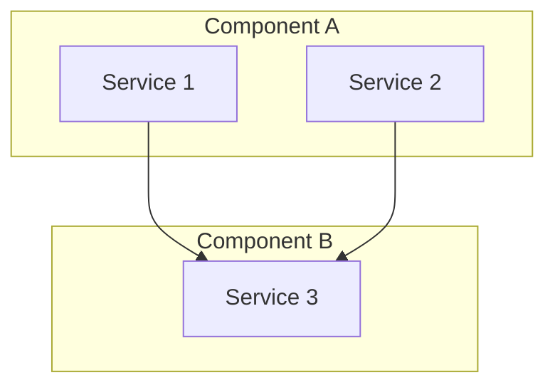

# {{name}}

{{description}}

## Diagram

## Components

### Component A

Description of component A and its role.

### Component B

Description of component B and its role.

## Data Flow

1. Data enters through...
2. Processed by...
3. Stored in...

## Key Interactions

| From | To | Protocol | Description |
|------|-----|----------|-------------|
| Service 1 | Service 3 | gRPC | Description |

## Related

- [Domain](../domains/{{domain}}/index.md)
- [Infrastructure](../infrastructure/{{infra}}.md)
