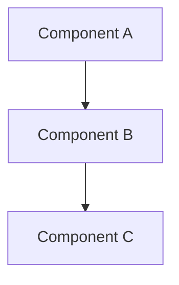

# {{name}}

{{description}}

## Overview

High-level description of this infrastructure component.

## Architecture

### Components

- Component 1
- Component 2

### Diagram

## Configuration

### Environment Variables

| Variable | Required | Description | Default |
|----------|----------|-------------|---------|
| VAR_NAME | Yes | Description | - |

### Secrets

| Secret | Location | Description |
|--------|----------|-------------|
| SECRET_NAME | Secret Manager | Description |

## Deployment

### Prerequisites

- Prerequisite 1
- Prerequisite 2

### Steps

1. Step 1
2. Step 2

## Monitoring

### Metrics

| Metric | Description | Alert Threshold |
|--------|-------------|-----------------|
| metric_name | Description | > 100 |

### Alerts

- Alert 1: Description
- Alert 2: Description

## Runbooks

- [Runbook 1](../../operations/runbooks/{{name}}.md)

## Related

- [Domain](../../domains/{{domain}}/index.md)
