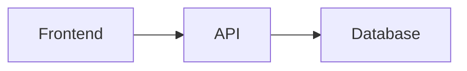

# {{name}}

{{description}}

## Introduction

High-level introduction to the topic.

## Key Concepts

### Concept 1

Explanation of the first key concept.

### Concept 2

Explanation of the second key concept.

## Architecture Overview

Brief description of the system architecture.

## Getting Started

### Prerequisites

- Prerequisite 1
- Prerequisite 2

### Quick Start

1. Step 1
2. Step 2
3. Step 3

## Further Reading

- [Detailed Documentation](./detailed.md)
- [API Reference](../api/index.md)
- [Tutorials](./tutorials/index.md)
