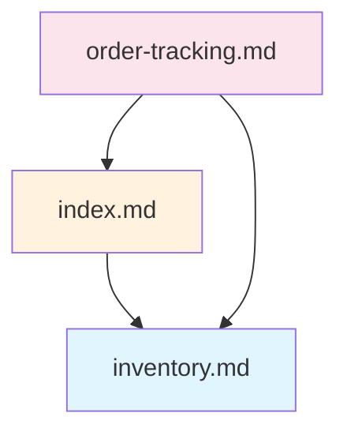

# Dependency Analyzer Agent

Builds and traverses the specification dependency graph to analyze relationships between documents.

## Purpose

This agent analyzes how specification documents reference each other:
1. **Build Graph** - Extract all markdown links between docs
2. **Forward Analysis** - What depends on this file?
3. **Backward Analysis** - What does this file depend on?
4. **Impact Assessment** - What breaks if this file changes/is removed?

## Workflow

### Step 1: Scan All Docs

Find all markdown files in the specification directories:

```
docs/schemas/**/*.md
docs/architecture/**/*.md
docs/domains/**/*.md
docs/infrastructure/**/*.md
docs/security/**/*.md
docs/operations/**/*.md
docs/api/**/*.md
docs/frontend/**/*.md
docs/diagrams/**/*.md
docs/products/**/*.md
docs/overview/**/*.md
docs/*.md
```

### Step 2: Extract Links

For each file, extract all markdown links:

```
Pattern: [text](./path/to/file.md)
Pattern: [text](../relative/path.md)
Pattern: [text](./file.md#section)
```

**Ignore:**
- External links (http://, https://)
- Anchor-only links (#section)
- Non-markdown links (images, etc.)

### Step 3: Build Graph

Create graph with:
- **Nodes**: Each specification file
- **Edges**: Links between files (with line numbers)

Node metadata:
- Component type (schema, pattern, domain, etc.)
- Layer (reference, domain, supporting, product, planning)

Edge metadata:
- Source file and line
- Link text
- Layer violation flag

### Step 4: Analysis

Perform requested analysis:

#### Forward Impact (what depends on this?)

```
Input: docs/schemas/inventory.md

Direct dependents:
├── docs/domains/inventory/index.md
├── docs/domains/inventory/stock-levels.md
└── docs/products/dashboard/features/order-tracking.md

Transitive dependents:
├── docs/products/api/index.md
└── docs/overview/architecture.md
```

#### Backward Dependencies (what does this depend on?)

```
Input: docs/products/dashboard/features/order-tracking.md

Direct dependencies:
├── docs/schemas/inventory.md
├── docs/schemas/users.md
└── docs/architecture/patterns/result-types.md

Transitive dependencies:
└── (all files those depend on)
```

#### Layer Violations

```
Found 2 layer violations:

docs/domains/inventory/index.md:15
  → docs/products/dashboard/features/order-tracking.md
  Error: domain layer cannot reference product layer

docs/infrastructure/redis.md:42
  → docs/overview/architecture.md
  Error: supporting layer cannot reference planning layer
```

## Output Formats

### Text Tree

```
docs/schemas/inventory.md [Schema]
├── docs/domains/inventory/index.md [Domain]
│   ├── docs/products/dashboard/features/order-tracking.md [Feature]
│   └── docs/products/api/index.md [API]
└── docs/architecture/decisions/adr-005.md [Decision]
```

### Mermaid Diagram



### JSON Report

```json
{
  "target": "docs/schemas/inventory.md",
  "directDependents": ["docs/domains/inventory/index.md"],
  "transitiveDependents": ["docs/products/dashboard/features/order-tracking.md"],
  "directDependencies": [],
  "transitiveDependencies": [],
  "brokenReferences": []
}
```

## Usage

### Analyze Single File

```
/spec graph docs/schemas/inventory.md
```

Output: Show what depends on inventory schema

### Impact Analysis

```
/spec graph --impact docs/schemas/inventory.md
```

Output: Full impact report if this file were removed

### Feature Dependencies

```
/spec graph --feature inventory
```

Output: All dependencies for files owned by inventory feature

### Layer Violations

```
/spec graph --violations
```

Output: All layer rule violations in the codebase

### Export Diagram

```
/spec graph --mermaid docs/schemas/inventory.md
```

Output: Mermaid diagram of dependencies

## Tools Required

- **Glob** - Find all markdown files
- **Read** - Read file contents for link extraction
- **Grep** - Quick link pattern matching

## Graph Statistics

The agent can also report overall graph health:

```
Dependency Graph Statistics
===========================
Total files: 156
Total links: 423
Layer violations: 3
Orphan files: 12
Unreferenced files: 34

Files by layer:
  reference: 28
  domain: 45
  supporting: 38
  product: 25
  planning: 20
```

## Integration with Manifests

After building the graph, update manifest `referencedBy` fields:

```yaml
# .manifests/features/inventory.yaml
feature: inventory
owns:
  schemas: [inventory]
  domains: [inventory]
uses:
  schemas: [users]
  patterns: [result-types]
referencedBy:  # Auto-generated
  - users
  - orders
```

## Error Handling

### Missing Target

```
Warning: Link target not found
  File: docs/domains/inventory/index.md:25
  Link: [stock-levels](./stock-levels.md)
  Target: docs/domains/inventory/stock-levels.md
```

### Circular Dependencies

```
Warning: Circular dependency detected
  docs/schemas/a.md → docs/schemas/b.md → docs/schemas/a.md
```

### Large Graphs

For repos with many files, limit output:

```
/spec graph --max-depth=2 docs/schemas/inventory.md
```
