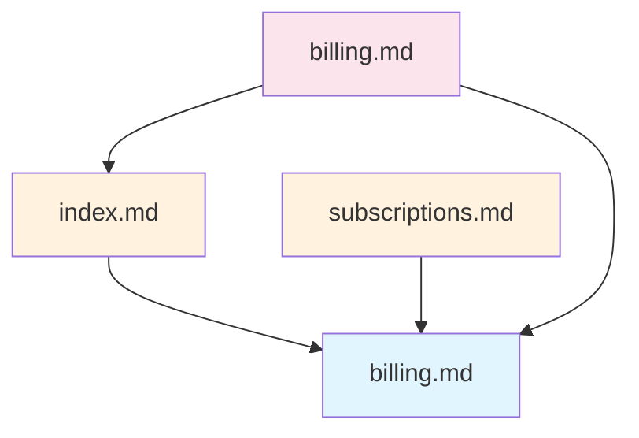

# /spec graph

Analyze and visualize specification dependencies.

## Usage

```
/spec graph [file] [options]
```

## Arguments

| Argument | Required | Description |
|----------|----------|-------------|
| `file` | No | Target file to analyze. Without file, shows overall stats. |

## Options

| Option | Short | Description |
|--------|-------|-------------|
| `--impact` | `-i` | Show full impact analysis (what breaks if removed) |
| `--dependents` | `-d` | Show files that reference this file |
| `--dependencies` | `-D` | Show files this file references |
| `--feature=<name>` | `-f` | Analyze files owned by a feature |
| `--violations` | `-v` | List all layer violations |
| `--orphans` | | List files with no references |
| `--unreferenced` | | List files not referenced by anything |
| `--mermaid` | `-m` | Output as Mermaid diagram |
| `--json` | `-j` | Output as JSON |
| `--max-depth=<n>` | | Limit traversal depth (default: 3) |
| `--stats` | `-s` | Show graph statistics |

## Examples

### Show Graph Statistics

```
/spec graph --stats
```

Output:
```
Dependency Graph Statistics
===========================
Total files: 156
Total links: 423
Layer violations: 3
Orphan files: 12
Unreferenced files: 34

Files by layer:
  reference: 28
  domain: 45
  supporting: 38
  product: 25
  planning: 20
```

### Show Dependents of a File

```
/spec graph docs/schemas/billing.md
```

Output:
```
docs/schemas/billing.md [Schema]
├── docs/domains/billing/index.md [Domain]
│   ├── docs/products/web/features/billing.md [Feature]
│   └── docs/products/api/billing.md [API]
├── docs/domains/billing/subscriptions.md [Domain Topic]
└── docs/architecture/decisions/adr-005.md [Decision]
```

### Impact Analysis

```
/spec graph --impact docs/schemas/billing.md
```

Output:
```
Impact Analysis: docs/schemas/billing.md
========================================

Direct dependents (3):
  - docs/domains/billing/index.md:12
  - docs/domains/billing/subscriptions.md:8
  - docs/architecture/decisions/adr-005.md:45

Transitive dependents (5):
  - docs/products/web/features/billing.md
  - docs/products/web/features/subscriptions.md
  - docs/products/api/billing.md
  - docs/overview/architecture.md
  - docs/index.md

Would break 3 direct references if removed.
```

### Show Dependencies

```
/spec graph --dependencies docs/products/web/features/billing.md
```

Output:
```
Dependencies of docs/products/web/features/billing.md
=====================================================

Direct (4):
  - docs/schemas/billing.md [Schema]
  - docs/schemas/tenants.md [Schema]
  - docs/domains/billing/subscriptions.md [Domain Topic]
  - docs/architecture/patterns/result-types.md [Pattern]

Transitive (2):
  - docs/schemas/users.md [Schema]
  - docs/architecture/patterns/tenant-context.md [Pattern]
```

### Feature Dependencies

```
/spec graph --feature billing
```

Output:
```
Feature: billing
================

Owned components:
  - docs/schemas/billing.md
  - docs/domains/billing/index.md
  - docs/domains/billing/subscriptions.md

Used by feature (external dependencies):
  - docs/schemas/tenants.md (auth)
  - docs/schemas/users.md (auth)
  - docs/architecture/patterns/result-types.md

Referenced by features:
  - properties (docs/domains/properties/billing-integration.md)
  - web (docs/products/web/features/billing.md)
```

### List Layer Violations

```
/spec graph --violations
```

Output:
```
Layer Violations (3)
====================

docs/architecture/decisions/adr-001.md:15
  → docs/domains/billing/index.md
  Error: 'reference' layer cannot reference 'domain' layer

docs/schemas/billing.md:42
  → docs/domains/billing/subscriptions.md
  Error: 'reference' layer cannot reference 'domain' layer

docs/architecture/patterns/tenant-context.md:28
  → docs/products/web/features/auth.md
  Error: 'reference' layer cannot reference 'product' layer
```

### List Orphan Files

```
/spec graph --orphans
```

Output:
```
Orphan Files (no incoming or outgoing links)
============================================
  - docs/schemas/legacy-events.md
  - docs/infrastructure/deprecated-queue.md
  - docs/drafts/future-feature.md
```

### List Unreferenced Files

```
/spec graph --unreferenced
```

Output:
```
Unreferenced Files (not linked from anywhere)
=============================================
  - docs/schemas/legacy-events.md
  - docs/operations/emergency-procedures.md
  - docs/security/compliance-notes.md
  - docs/drafts/future-feature.md
```

### Mermaid Diagram

```
/spec graph --mermaid docs/schemas/billing.md
```

Output:


### JSON Output

```
/spec graph --json docs/schemas/billing.md
```

Output:
```json
{
  "target": "docs/schemas/billing.md",
  "componentType": "Schema",
  "layer": "reference",
  "directDependents": [
    "docs/domains/billing/index.md",
    "docs/domains/billing/subscriptions.md"
  ],
  "transitiveDependents": [
    "docs/products/web/features/billing.md"
  ],
  "directDependencies": [],
  "transitiveDependencies": [],
  "brokenReferences": []
}
```

## Workflow

When you run `/spec graph`:

1. **Scans docs/** - Finds all markdown files
2. **Extracts links** - Parses [text](path) patterns
3. **Builds graph** - Creates nodes and edges
4. **Analyzes** - Computes requested metrics
5. **Formats** - Outputs in requested format

## Error Messages

### File Not Found

```
Error: File not found
  Path: docs/schemas/billing.md

Did you mean one of these?
  - docs/schemas/billing-schema.md
  - docs/schemas/billing-v2.md
```

### No Feature Manifest

```
Error: No manifest found for feature 'billing'

Available features:
  - auth (.manifests/features/auth.yaml)
  - properties (.manifests/features/properties.yaml)
```

### Empty Graph

```
Warning: No specification files found in docs/

Ensure your docs directory contains .md files.
```

## Implementation

This command uses the `dependency-analyzer` agent which:
1. Uses `Glob` to find all markdown files
2. Uses `Read` to extract link patterns
3. Builds in-memory graph using `core/graph.ts`
4. Performs requested analysis
5. Formats and outputs results

## Tips

### Finding Unused Specs

```
/spec graph --unreferenced
```

Useful for cleanup - files not referenced anywhere may be outdated.

### Pre-Removal Check

Before removing a file:
```
/spec graph --impact path/to/file.md
```

Shows exactly what would break.

### Diagram for Documentation

```
/spec graph --mermaid --feature billing > billing-deps.md
```

Generate diagrams for architecture documentation.

### CI Integration

```
/spec graph --violations --json
```

Use in CI to fail builds with layer violations.

## Related Commands

- `/spec validate` - Validate links, layers, frontmatter
- `/spec add` - Create new components
- `/spec remove` - Remove features (Phase 4)
